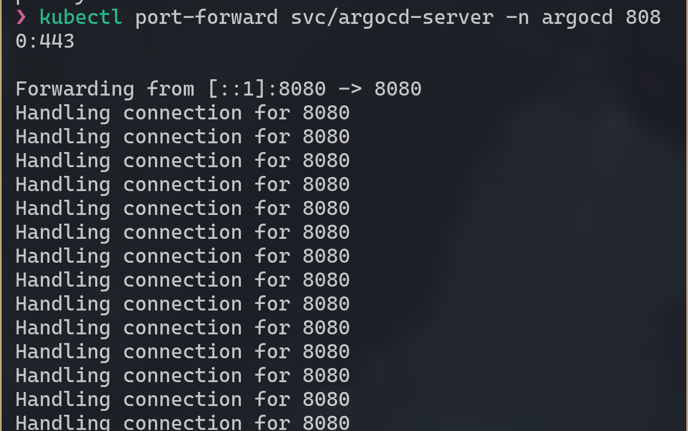
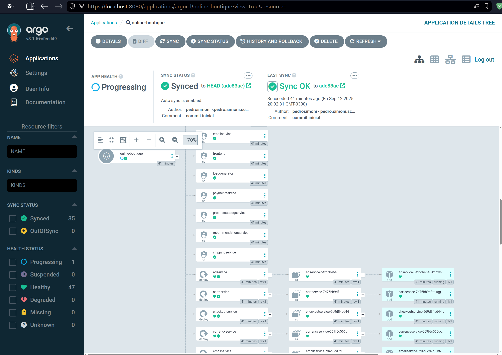
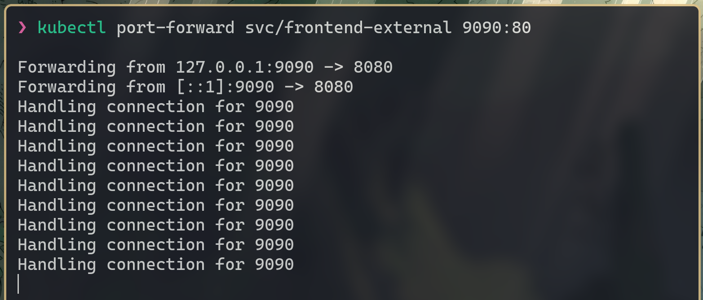
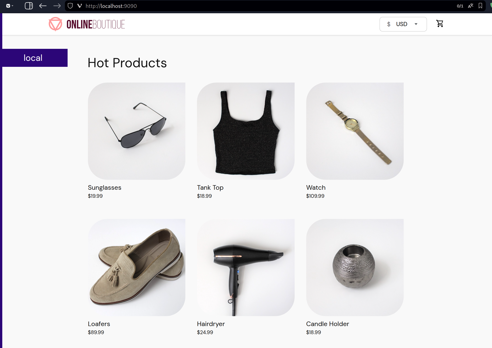
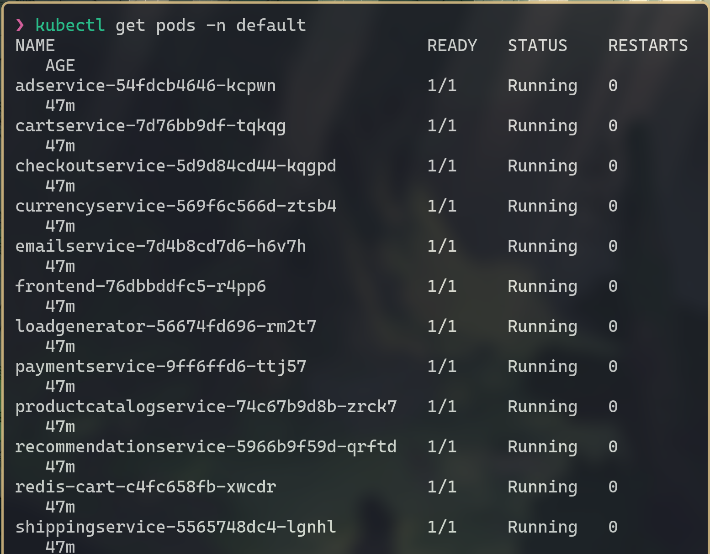
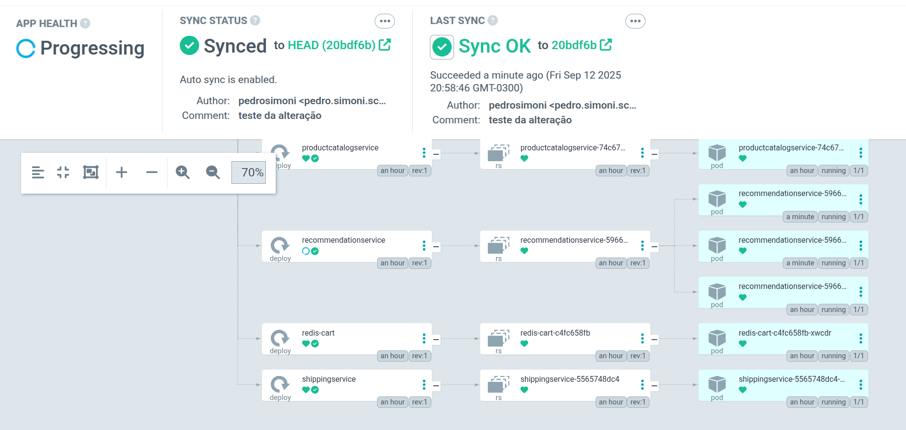
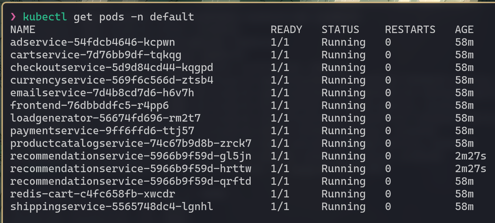

[](README.en.md)
[](README.md)

# Project 3 - Application Deployment with GitOps, Kubernetes, and ArgoCD

This project documents the deployment of a microservices application in a local Kubernetes environment. The objective is to use **GitOps** practices, where the Git repository serves as the single source of truth for the infrastructure and the application, with changes being automatically applied to the cluster by the **ArgoCD** tool.

Learning Kubernetes allows one to understand how applications run in distributed environments, while GitOps, with tools like ArgoCD, enables automated and secure deployments with just a `git push`.

## Table of Contents

- [1. Project Overview](#1-project-overview)
  - [1.1. Objective](#11-objective)
  - [1.2. Technologies Used](#12-technologies-used)
- [2. Environment Setup](#2-environment-setup)
- [3. Git Repository Configuration (Source of Truth)](#3-git-repository-configuration-source-of-truth)
- [4. ArgoCD Installation and Access](#4-argocd-installation-and-access)
  - [4.1. Installation via Manifests](#41-installation-via-manifests)
  - [4.2. Accessing the Web UI](#42-accessing-the-web-ui)
- [5. Application Creation and Synchronization](#5-application-creation-and-synchronization)
- [6. Validation and Testing](#6-validation-and-testing)
  - [6.1. Accessing the Application Frontend](#61-accessing-the-application-frontend)
  - [6.2. Verifying Pods](#62-verifying-pods)
  - [6.3. (Optional) Testing the GitOps Flow](#63-optional-testing-the-gitops-flow)
- [7. Conclusion](#7-conclusion)

## 1. Project Overview

### 1.1. Objective

To run a set of microservices (Online Boutique) in a local Kubernetes cluster (managed by Rancher Desktop), with the entire deployment lifecycle controlled by GitOps with ArgoCD from a public GitHub repository.

### 1.2. Technologies Used

- **Kubernetes**: Container orchestrator for managing the application.
- **Rancher Desktop**: Tool to run containers locally.
- **ArgoCD**: GitOps tool for Kubernetes.
- **Docker**: Container engine.
- **Git & GitHub**: Version control system and repository hosting platform.
- **kubectl**: Command-line tool for interacting with the Kubernetes cluster.

## 2. Environment Setup

Before starting, it is necessary to ensure that all tools are installed and configured according to your OS.

- **Rancher Desktop**: Installed with Kubernetes enabled.
- **Git**: Installed on the system.
- **kubectl**: Kubernetes CLI installed and configured to access the Rancher cluster.

To verify the connection to the cluster, the `kubectl get nodes` command should return the active node.

```h
kubectl get nodes
```

## 3. Git Repository Configuration (Source of Truth)

The first step in the GitOps workflow is to define a repository that will contain the application's manifests.

1.  **Fork the original repository**: A fork of the `GoogleCloudPlatform/microservices-demo` project was created.
2.  **Create a new repository**: This new public repository (`gitops-online-boutique`) was created to store the deployment manifest and the project documentation.
3.  **Isolate the manifest**: The `release/kubernetes-manifests.yaml` file from the original project was copied to the new repository following the `k8s/online-boutique.yaml` structure.

```bash
# Clone the fork
git clone https://github.com/pedrosimoni/microservices-demo

# Create the structure and copy the manifest
mkdir -p ./gitops-online-boutique/k8s
cp ./microservices-demo/release/kubernetes-manifests.yaml ./gitops-online-boutique/k8s/online-boutique.yaml

# Initialize and push to the new repository
cd ./gitops-online-boutique
git init
git add .
git commit -m "initial commit"
git branch -M main
git remote add origin https://github.com/pedrosimoni/gitops-online-boutique.git
git push -u origin main
```

## 4. ArgoCD Installation and Access

### 4.1. Installation via Manifests

With the cluster running, we installed ArgoCD in its own namespace to manage the applications.

```sh
# Create the namespace for ArgoCD
kubectl create namespace argocd

# Apply the installation manifest
kubectl apply -n argocd -f https://raw.githubusercontent.com/argoproj/argo-cd/stable/manifests/install.yaml
```

### 4.2. Accessing the Web UI

To configure ArgoCD, we access its web interface.

1.  **Expose the UI with `port-forward`**:
    ```sh
    kubectl port-forward svc/argocd-server -n argocd 8080:443
    ```



2.  **Get the initial password**: The default user is `admin`, and the password is automatically generated.
    ```sh
    kubectl -n argocd get secret argocd-initial-admin-secret -o jsonpath="{.data.password}" | base64 -d
    ```

After running the commands, the interface becomes accessible at `https://localhost:8080`.

## 5. Application Creation and Synchronization

With access to the ArgoCD interface, the application was created to connect the Git repository to the cluster.

- **Application Name**: `online-boutique`
- **Project**: `default`
- **Repository URL**: URL of the repository created in step 3.
- **Path**: `k8s`
- **Cluster URL**: `https://kubernetes.default.svc`
- **Namespace**: `default`

The `Sync Policy` was set to `Automatic`, with the `Prune Resources` and `Self Heal` options enabled to ensure the cluster's state always reflects what is in Git.

The tool for processing the manifests was kept as `Directory`, as the repository contains standard Kubernetes YAML files.



## 6. Validation and Testing

### 6.1. Accessing the Application Frontend

The application's frontend service is of type `ClusterIP`, requiring it to be exposed with `port-forward` for external access.

```sh
kubectl port-forward svc/frontend-external 9090:80
```



With the command running, the application became available at `http://localhost:9090`.



### 6.2. Verifying Pods

To ensure all microservices were deployed and are running, the following command was used:

```sh
kubectl get pods -n default
```



### 6.3. (Optional) Testing the GitOps Flow

To test the complete flow, the number of replicas for the `recommendationservice` was changed from 1 to 3 directly in the `k8s/online-boutique.yaml` file.

yaml
apiVersion: apps/v1
kind: Deployment
metadata:
  name: recommendationservice
  labels:
    app: recommendationservice
spec:
  replicas: 3 # <--- Added on line 185
  selector:
    matchLabels:
      app: recommendationservice
  template:
    metadata:
      labels:
        app: recommendationservice

After the `git push`, ArgoCD detected the change and automatically adjusted the `Deployment` in the cluster, scaling the service to 3 pods, thus validating the GitOps cycle.



```sh
# Verification after the change via Git
kubectl get pods | grep recommendationservice
```



## 7. Conclusion

This project demonstrated in practice the efficiency of GitOps for managing applications in Kubernetes. By using Git as the single source of truth and ArgoCD as the synchronization agent, the deployment process becomes declarative, automated, and fully traceable, aligning with the best practices of DevOps and Cloud-Native.