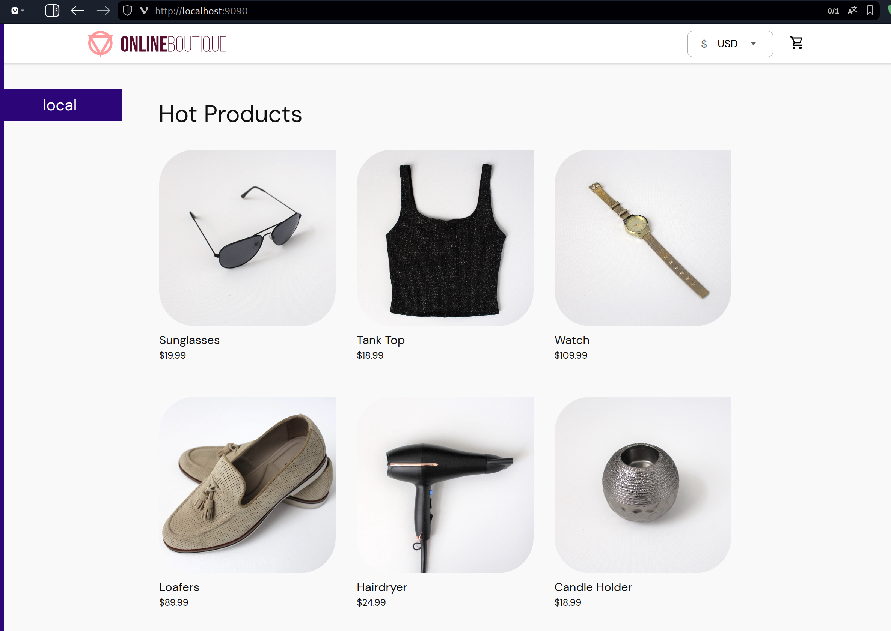
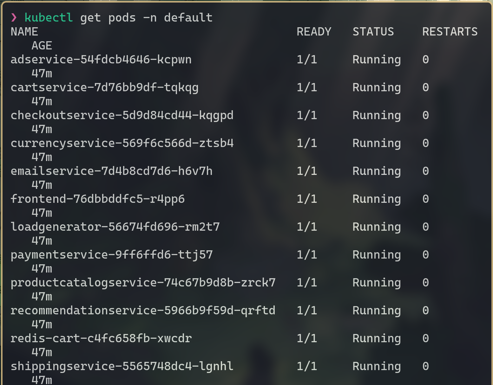

[](README.en.md)
[](README.md)

# Projeto 3 - Implantação de Aplicação com GitOps, Kubernetes e ArgoCD

Este projeto documenta a implantação de uma aplicação de microsserviços em um ambiente Kubernetes local. O objetivo é utilizar práticas de **GitOps**, onde o repositório Git serve como a única fonte de verdade para a infraestrutura e a aplicação, com as mudanças sendo aplicadas automaticamente no cluster pela ferramenta **ArgoCD**.

Aprender Kubernetes permite entender como aplicações são executadas em ambientes distribuídos, enquanto o GitOps, com ferramentas como o ArgoCD, permite fazer deploys de forma automatizada e segura apenas com um `git push`.

## Sumário

- [1. Visão Geral do Projeto](#1-visão-geral-do-projeto)
  - [1.1. Objetivo](#11-objetivo)
  - [1.2. Tecnologias Utilizadas](#12-tecnologias-utilizadas)
- [2. Preparação do Ambiente](#2-preparação-do-ambiente)
- [3. Configuração do Repositório Git (Fonte da Verdade)](#3-configuração-do-repositório-git-fonte-da-verdade)
- [4. Instalação e Acesso ao ArgoCD](#4-instalação-e-acesso-ao-argocd)
  - [4.1. Instalação via Manifestos](#41-instalação-via-manifestos)
  - [4.2. Acesso à Interface Web](#42-acesso-à-interface-web)
- [5. Criação e Sincronização da Aplicação](#5-criação-e-sincronização-da-aplicação)
- [6. Validação e Testes](#6-validação-e-testes)
  - [6.1. Acesso ao Frontend da Aplicação](#61-acesso-ao-frontend-da-aplicação)
  - [6.2. Verificação dos Pods](#62-verificação-dos-pods)
  - [6.3. (Opcional) Testando o Fluxo GitOps](#63-opcional-testando-o-fluxo-gitops)
- [7. Conclusão](#7-conclusão)

## 1. Visão Geral do Projeto

### 1.1. Objetivo

Executar um conjunto de microsserviços (Online Boutique) em um cluster Kubernetes local (gerenciado pelo Rancher Desktop), com todo o ciclo de deploy controlado por GitOps com ArgoCD a partir de um repositório público no GitHub.

### 1.2. Tecnologias Utilizadas

- **Kubernetes**: Orquestrador de contêineres para gerenciar a aplicação.
- **Rancher Desktop**: Ferramenta para rodar contêineres localmente.
- **ArgoCD**: Ferramenta de GitOps para Kubernetes.
- **Docker**: Mecanismo de contêineres.
- **Git & GitHub**: Sistema de controle de versão e plataforma de hospedagem do repositório.
- **kubectl**: Ferramenta de linha de comando para interagir com o cluster Kubernetes.

## 2. Preparação do Ambiente

Antes de iniciar, é necessário garantir que todas as ferramentas estejam instaladas e configuradas de acordo com o seu SO.

- **Rancher Desktop**: Instalado com o Kubernetes habilitado.
- **Git**: Instalado no sistema.
- **kubectl**: CLI do Kubernetes instalada e configurada para acessar o cluster do Rancher.

Para verificar a conexão com o cluster, o comando `kubectl get nodes` deve retornar o nó ativo.

```sh
kubectl get nodes
```

## 3. Configuração do Repositório Git (Fonte da Verdade)

O primeiro passo do fluxo GitOps é definir um repositório que conterá os manifestos da aplicação.

1.  **Fork do repositório original**: Foi criado um fork do projeto `GoogleCloudPlatform/microservices-demo`.
2.  **Criação de um novo repositório**: Esse novo repositório público (`gitops-online-boutique`) foi criado para armazenar o manifesto de implantação e a documentação do projeto.
3.  **Isolamento do manifesto**: O arquivo `release/kubernetes-manifests.yaml` do projeto original foi copiado para o novo repositório seguindo a estrutura `k8s/online-boutique.yaml`.

```bash
# Clone do fork
git clone [https://github.com/pedrosimoni/microservices-demo](https://github.com/pedrosimoni/microservices-demo)

# Criação da estrutura e cópia do manifesto
mkdir -p ./gitops-online-boutique/k8s
# Copie a configuração de https://github.com/GoogleCloudPlatform/microservices-demo/blob/main/release/kubernetes-manifests.yaml
vim ./gitops-online-boutique/k8s/online-boutique.yaml

# Inicialização e push para o novo repositório
cd ./gitops-online-boutique
git init
git add .
git commit -m "commit inicial"
git branch -M main
git remote add origin [https://github.com/pedrosimoni/gitops-online-boutique.git](https://github.com/pedrosimoni/gitops-online-boutique.git)
git push -u origin main
```

## 4. Instalação e Acesso ao ArgoCD

### 4.1. Instalação via Manifestos

Com o cluster no ar, instalamos o ArgoCD em seu próprio namespace para gerenciar as aplicações.

```sh
# Criação do namespace para o ArgoCD
kubectl create namespace argocd

# Aplicação do manifesto de instalação
kubectl apply -n argocd -f [https://raw.githubusercontent.com/argoproj/argo-cd/stable/manifests/install.yaml](https://raw.githubusercontent.com/argoproj/argo-cd/stable/manifests/install.yaml)
```

### 4.2. Acesso à Interface Web

Para configurar o ArgoCD, acessamos sua interface web.

1.  **Expor a UI com `port-forward`**:
    ```sh
    kubectl port-forward svc/argocd-server -n argocd 8080:443
    ```


2.  **Obter a senha inicial**: O usuário padrão é `admin` e a senha é gerada automaticamente.
    ```sh
    kubectl -n argocd get secret argocd-initial-admin-secret -o jsonpath="{.data.password}" | base64 -d
    ```

Após executar os comandos, a interface se torna acessível em `https://localhost:8080`.

## 5. Criação e Sincronização da Aplicação

Com o acesso à interface do ArgoCD, a aplicação foi criada para conectar o repositório Git ao cluster.

- **Application Name**: `online-boutique`
- **Project**: `default`
- **Repository URL**: URL do repositório criado no passo 3.
- **Path**: `k8s`
- **Cluster URL**: `https://kubernetes.default.svc`
- **Namespace**: `default`

A política de sincronização (`Sync Policy`) foi configurada como `Automatic`, com as opções `Prune Resources` e `Self Heal` ativadas para garantir que o estado do cluster sempre reflita o que está no Git.

A ferramenta para processar os manifestos foi mantida como `Directory`, pois o repositório contém arquivos YAML padrão do Kubernetes.


## 6. Validação e Testes

### 6.1. Acesso ao Frontend da Aplicação

O serviço de frontend da aplicação é do tipo `ClusterIP`, sendo necessário expô-lo com `port-forward` para acesso externo.

```sh
kubectl port-forward svc/frontend-external 9090:80
```


Com o comando em execução, a aplicação ficou disponível em `http://localhost:9090`.



### 6.2. Verificação dos Pods

Para garantir que todos os microsserviços foram implantados e estão rodando, o seguinte comando foi utilizado:

```sh
kubectl get pods -n default
```



### 6.3. (Opcional) Testando o Fluxo GitOps

Para testar o fluxo completo, o número de réplicas do `recommendationservice` foi alterado de 1 para 3 diretamente no arquivo `k8s/online-boutique.yaml`.

```yaml
apiVersion: apps/v1
kind: Deployment
metadata:
  name: recommendationservice
  labels:
    app: recommendationservice
spec:
  replicas: 3 # <--- Adição na linha 185
  selector:
    matchLabels:
      app: recommendationservice
  template:
    metadata:
      labels:
        app: recommendationservice
```

Após o `git push`, o ArgoCD detectou a alteração e, automaticamente, ajustou o `Deployment` no cluster, escalando o serviço para 3 pods, validando o ciclo de GitOps.

```sh
# Verificação após a alteração via Git
kubectl get pods | grep recommendationservice
```

## 7. Conclusão

Este projeto demonstrou na prática a eficiência do GitOps para gerenciar aplicações no Kubernetes. Ao utilizar o Git como fonte da verdade e o ArgoCD como agente de sincronização, o processo de deploy se torna declarativo, automatizado e totalmente rastreável, alinhado com as melhores práticas de DevOps e Cloud-Native.
